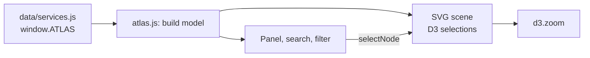

# Architecture

## Overview

Constellate is a static page. `index.html` loads D3 v7 from cdnjs, then `data/services.js` (which sets `window.ATLAS`) and `assets/js/atlas.js` (which renders it). Scripts load as classic scripts rather than ES modules, so the page works when opened from the file system as well as when hosted.

## Coordinate system and layout

- Services sit at hand-placed `x`, `y` positions in a world space of roughly 1600 × 1100 units.
- Components are placed around their service on alternating radii (106 and 152 units) with a small seeded jitter, starting at the service's `angle`. The seeded random generator (`mulberry(365)`) keeps the layout identical on every load.
- Components left of their service get right-aligned labels so text points away from the centre.

## Zoom and constant-size stars

The whole scene sits in one `<g>` transformed by `d3.zoom`. To stop stars and labels growing as you zoom, each node's inner group is counter-scaled with CSS: `transform: scale(var(--inv))`, where `--inv = 1 / k` is set on the SVG on every zoom event. Lines use `vector-effect: non-scaling-stroke` for the same reason. The result is that positions spread apart when zooming while symbols stay the same size on screen.

`fitTo(bounds)` computes a transform that fits a bounding box into the visible area, subtracting the top bar and the details panel (right side on desktop, bottom sheet under 720 px). Feature labels appear once zoom exceeds 1.6× the overview scale (the `.deep` class).

## State

A single `state` object holds `focus` (service in view), `sel` (selected node), `plan` and `suites` (licence filter; see `inPlan()`). `selectNode(id)` is the one entry point for navigation from stars, search results, breadcrumbs and panel lists. `apply()` syncs CSS classes, threads and breadcrumbs from state.

## Relationships

`related` arrays are made bidirectional at load time into `REL` (a map of Sets), so data only needs one direction. Threads are quadratic curves from the selected feature to each related feature, coloured by the target's service.

## Theming

Colours are CSS custom properties on `:root`, redefined for dark mode both under `@media (prefers-color-scheme: dark)` (guarded by `:root:not([data-theme="light"])`) and under `:root[data-theme="dark"]`, so a host can force either theme with a `data-theme` attribute. Each service has its own token (`--entra`, `--intune`, and so on), assigned to a group as `--c` so every child element can use `var(--c)`.

## Design decisions

- **Visual language:** a celestial atlas rather than a network diagram. Service names use EB Garamond italic, echoing engraved constellation labels on historical star charts. UI text uses IBM Plex Sans.
- **Light mode is a printed atlas, dark mode is the night sky.** Service colours loosely follow stellar spectral classes (blue, yellow, orange, red) and are tuned per theme for contrast.
- **One memorable interaction:** the threads between related features. Everything else stays quiet.
- **Motion:** one staggered reveal on load plus transitions that answer user actions. All of it is disabled under `prefers-reduced-motion`.

## Dependencies

| Dependency | Source | Why |
| --- | --- | --- |
| D3 7.9.0 | cdnjs | Zoom behaviour, selections, transitions |
| EB Garamond, IBM Plex Sans | Google Fonts | Typography, with system fallbacks |

To run fully offline, download `d3.min.js` into `assets/vendor/` and update the script tag.
